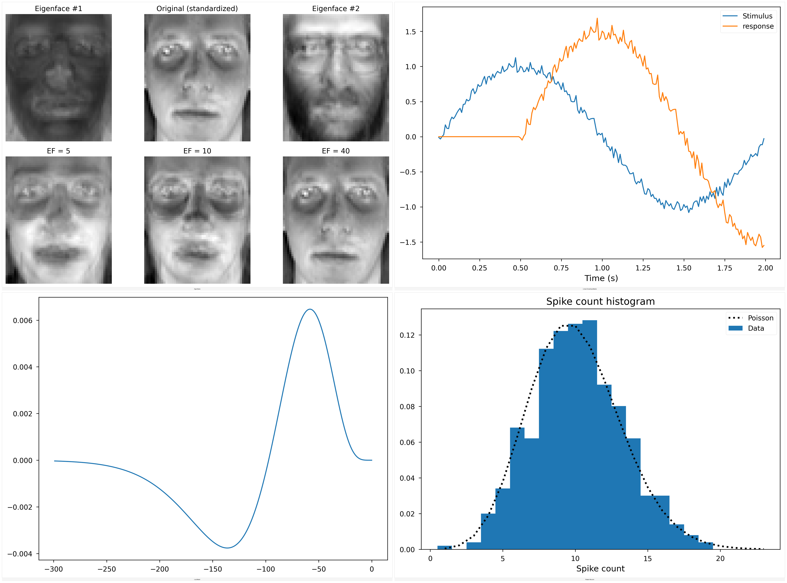

# Computational Neuroscience Demos — Automated Workflow

This fork modernizes and automates running classic computational neuroscience scripts (Weeks 02–08): fixing deprecations, adding a headless runner, auto‑downloading the AT&T faces dataset via KaggleHub, and organizing/saving results per task with optional weekly montages.

Key additions:
- `scripts/run_and_save.py` — headless runner that saves all Matplotlib figures per script to `outputs/<week>/<script>/figN.png`.
- `scripts/organize_outputs.py` — migrates legacy flat images to the new folder layout and slugifies names.
- `scripts/make_montage.py` — builds weekly overview montages (grids) combining multiple outputs.
- Modernized code: fixed deprecated `normed=True` histograms, `np.math.factorial`, SciPy `trapz`, added `seaborn`-style figures, and a robust `eigenfaces` data path with KaggleHub/scikit‑learn fallbacks.

Below are selected generated figures. “Coursera question” is intentionally excluded from composites per request.

## Quick Start

1) Python env
- Conda: `conda create -n cns python=3.10 -y && conda activate cns`
- Or venv (Windows): `python -m venv .venv && .\.venv\Scripts\Activate`

2) Install deps
- `pip install -r requirements.txt`

3) Run any demo and save plots
- `py -3 scripts/run_and_save.py week-05\hodgkin_huxley.py --outdir outputs`
- Figures save under `outputs/week-05/hodgkin_huxley/fig1.png`, etc.

4) Eigenfaces data (AT&T/ORL)
- Preferred: `pip install kagglehub`
- Run: `py -3 scripts/run_and_save.py week-02\eigenfaces.py -- --use-kagglehub`
- Alternative: `--data-dir <path-with-s1..s40>` or `--use-sklearn` fallback (Olivetti faces)

5) Organize old outputs (optional)
- `py -3 scripts/organize_outputs.py`

## Figures

### Week 02 — Linear Filters, LNP, Poisson, Eigenfaces

Overview montage:

Individuals:
- LNP: `outputs/week-02/lnp_model/fig1.png`
- Poisson neuron: `outputs/week-02/poisson_neuron/fig1.png`
- Linear encoding models: `outputs/week-02/linear_encoding_models/fig1.png`
- Eigenfaces: `outputs/week-02/eigenfaces/fig1.png`

### Week 03 — ROC/Neurometrics/Decoding

Overview montage (coursera_question excluded):

Individuals:
- Motion discrimination: `outputs/week-03/motion_discrimination/fig1.png`
- Population decoding: `outputs/week-03/population_decoding/fig1.png`

### Week 04 — Information Theory

- Entropy/M.I. plots: `outputs/week-04/Entropy/fig1.png`

### Week 05 — Membranes and Spiking Models

Overview montage:

Individuals:
- Hodgkin–Huxley: `outputs/week-05/hodgkin_huxley/fig1.png`
- Simplified (IF/eIF): `outputs/week-05/simplified_models/fig1.png`

### Week 06 — Synapses

- Kinetic/Filter synapse models: `outputs/week-06/modeling-synapses/fig1.png`

### Week 07 — Unsupervised Learning

Overview montage:

Individuals:
- Hebbian learning: `outputs/week-07/hebbian_learning/fig1.png`
- Competitive learning: `outputs/week-07/competitive_learning/fig1.png`
- EM (GMM): `outputs/week-07/em_algorithm/fig1.png`

### Week 08 — Supervised/RL

Overview montage:

Individuals:
- Perceptron classifiers: `outputs/week-08/perceptron_classifiers/fig1.png`
- Backpropagation: `outputs/week-08/backpropagation/fig1.png`
- TD rule: `outputs/week-08/td_rule/fig1.png`

## Workflow Details

Runner (headless, publication style):
- Non‑interactive backend (`Agg`) and seaborn‑paper theme with tuned rcParams.
- Automatically slugifies output folders: `outputs/<week>/<script>/figN.png`.
- Pass script args after `--` (e.g., eigenfaces KaggleHub flag).

Modernizations:
- Histograms: `density=True` replaces deprecated `normed=True`.
- Factorials: `math.factorial(...)` replaces `np.math.factorial`.
- ROC area: `scipy.integrate.trapezoid` replaces deprecated `trapz` usage.
- Sample images: prefers `scipy.datasets.ascent()` with safe fallbacks.
- Eigenfaces: `--data-dir`, `--use-kagglehub`, or `--use-sklearn` fallback.

Repro tips:
- Rebuild all week overviews by re‑running scripts then montages in `scripts/make_montage.py` (examples used to generate current `overview.png` files).
- To re‑organize legacy outputs anytime: `py -3 scripts/organize_outputs.py`.

**Quick Start**
- Create an environment
  - Conda: `conda create -n cns python=3.10 -y && conda activate cns`
  - Or venv: `python -m venv .venv && .\.venv\Scripts\Activate`
- Install deps: `pip install -r requirements.txt`

**Run Demos**
- Poisson neuron: `python week-02\poisson_neuron.py`
- LNP model: `python week-02\lnp_model.py`
- Population decoding: `python week-03\population_decoding.py`
- Hodgkin–Huxley: `python week-05\hodgkin_huxley.py`
- Perceptron: `python week-08\perceptron_classifiers.py`
- Notebooks: `jupyter notebook` then open the desired `.ipynb` files

**Eigenfaces Data (AT&T/ORL)**
- Use KaggleHub (recommended):
  - `pip install kagglehub`
  - Run: `python week-02\eigenfaces.py --use-kagglehub`
- Use local folder:
  - Download and unzip the dataset so it contains `s1..s40` subfolders
  - Run: `python week-02\eigenfaces.py --data-dir <path-to-dataset-root>`
- Use scikit-learn fallback (Olivetti faces): `python week-02\eigenfaces.py --use-sklearn`
